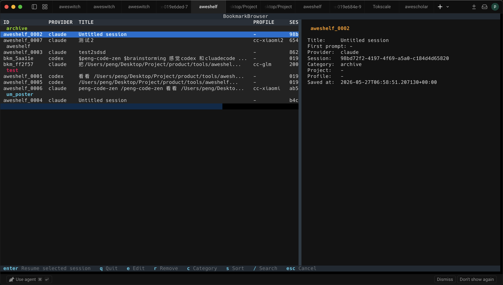
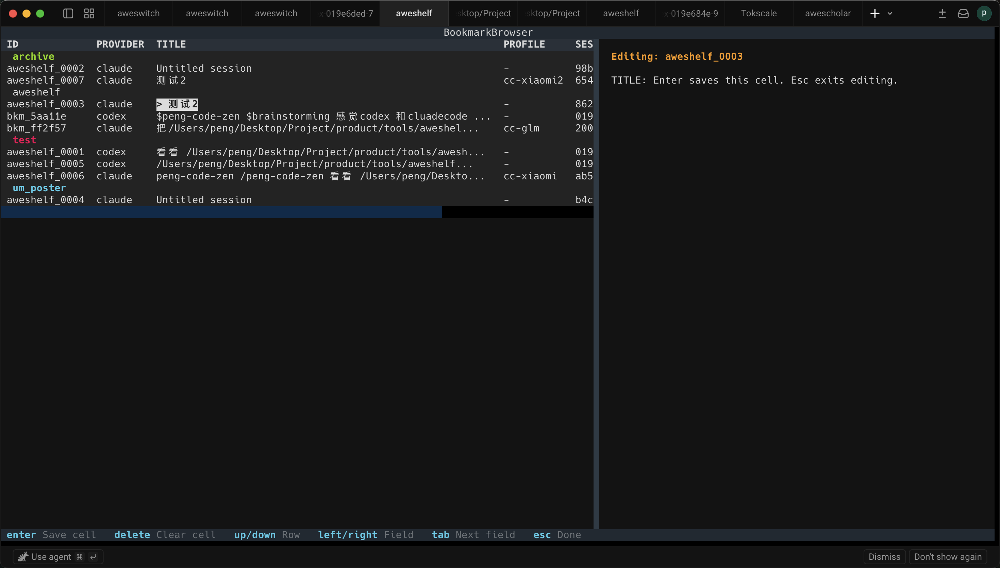
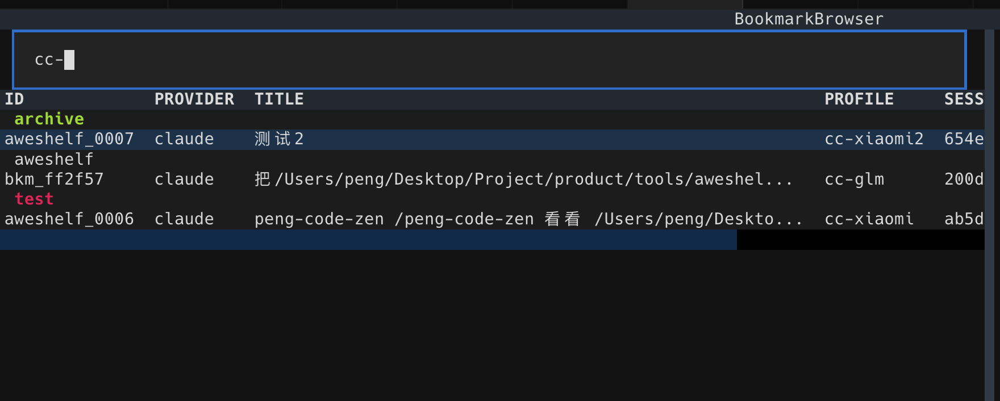

<div align="center">
  
  <h1>aweshelf: Session Bookmark Manager <a href="https://github.com/Webioinfo01/aweskill"></a></h1>
  <p><strong>Bookmark, categorize, and restore AI coding sessions with aweswitch profiles.</strong></p>
  <p>A lightweight CLI-first tool for Claude Code and Codex session management.</p>
  <p>
    <strong>English</strong> ·
    <a href="./README_cn.md">简体中文</a> ·
    <a href="https://we.webioinfo.top/">Webioinfo</a>
  </p>
  <p>
    
    
  </p>
  <p>
    
    
    
    
    
  </p>
</div>


> Bookmark, categorize, and restore AI coding sessions with aweswitch profiles.

aweshelf lets you save your favorite Claude Code and Codex sessions, tag them with categories, and restore them instantly — including the aweswitch profile (API endpoint, model, token) that was active when you bookmarked.

## Install

### Ask an AI agent

If you are working inside Claude Code, Codex, Cursor, or another coding agent, tell it:

```text
Read https://github.com/Webioinfo01/aweshelf/blob/main/README.ai.md and follow it to install aweshelf for this agent.
```

The agent will first install the `aweshelf` CLI, then choose one of two skill management options:

1. **Via [aweskill](https://aweskill.webioinfo.top/)** — installs and manages the skill from GitHub with update, projection, and backup support. Requires Node.js.
2. **Direct copy** — downloads `SKILL.md` into the agent's skill directory. No extra dependencies beyond Python, but future updates require copying the file again manually.

### pip

```bash
pip install aweshelf
```

### Optional: aweswitch

aweshelf saves the active aweswitch profile when you bookmark a session. Install [aweswitch](https://github.com/mugpeng/aweswitch) to enable multi-profile management — without it, aweshelf works but profile restore on resume is skipped.

With aweswitch, you can resume a session using the original provider (e.g. Claude Code official API) or switch to another configured profile like `cc-xiaomi`, `cc-glm`, etc. — each with its own API endpoint, token, and model.

```bash
pip install aweswitch
```

## Supported by

aweshelf is powered by two companion tools:

- **[aweskill](https://github.com/Webioinfo01/aweskill)** — CLI-first skill package manager for AI agents. Handles skill installation, updates, and projection across 47+ coding agents.
- **[aweswitch](https://github.com/mugpeng/aweswitch)** — Agent profile switcher. Lets you launch sessions with different API endpoints, tokens, and models. aweshelf stores aweswitch profiles in bookmarks so sessions restore with the right config.

## Usage

### AI Agent

Install the aweshelf skill (see [Install](#install) above), then just tell your agent what to do.

**Example requests:**

> "Bookmark the current session."

> "List my bookmarks in the backend category."

> "Search for bookmarks related to auth."

The agent uses the [SKILL.md](resources/skills/aweshelf/SKILL.md) to understand all available commands and workflows.

> **Tip:** Resuming a session (`aweshelf resume`) launches a new agent process, which may conflict with the current one. For resuming, it's best to exit the agent first and use `aweshelf browse` or `aweshelf resume` directly in your terminal.

### Human

The primary way to use aweshelf interactively is the TUI:

```bash
aweshelf browse
```

The browse view keeps bookmarks grouped by category, with the selected bookmark's details on the right.



Press `e` to edit the current cell in place. Title, category, and profile changes can be saved without leaving the TUI.



Press `/` to filter bookmarks by title, category, session, project, prompt, or profile.



`aweshelf browse` opens an interactive terminal UI with a sidebar table and detail pane. Browse, search, edit, and resume bookmarks without memorizing commands.

You can also use aweshelf as a regular CLI:

```bash
aweshelf bookmark                    # bookmark the current session
aweshelf list                        # list all bookmarks
aweshelf resume aweshelf_0001        # resume a bookmark
aweshelf search "auth"               # search bookmarks
```

See [Commands](#commands) below for the full CLI reference.

## Config

Bookmarks are stored at `~/.config/aweshelf/bookmarks.json`. Override with `AWESHELF_CONFIG` env var.

```json
{
  "version": 1,
  "bookmarks": [
    {
      "id": "aweshelf_0001",
      "provider": "claude",
      "session_id": "550e8400-...",
      "title": "Fix auth middleware bug",
      "category": "backend",
      "project_path": "/Users/peng/Desktop/Project/my-app",
      "aweswitch_profile": "cc-glm",
      "bookmarked_at": "2026-05-20T14:00:00Z"
    }
  ]
}
```

## Commands

```bash
aweshelf bookmark [SESSION_ID] [-t TITLE] [-c CATEGORY] [--profile PROFILE] [--current] [--verbose]
aweshelf list [-c CATEGORY] [-p PROVIDER]
aweshelf search QUERY              # search title, category, session, project, prompt, profile
aweshelf recent [-n COUNT]
aweshelf show BOOKMARK_ID [--json]
aweshelf edit BOOKMARK_ID [-t TITLE] [-c CATEGORY] [--profile PROFILE]
aweshelf rm BOOKMARK_ID [--force]
aweshelf resume BOOKMARK_ID [--profile PROFILE] [--raw] [--dry-run]
aweshelf browse
aweshelf help [COMMAND]
```

## Browse (TUI)

`aweshelf browse` opens an interactive TUI with a sidebar table and detail pane.
`aweshelf bookmark` marks already-bookmarked sessions and can update them after confirmation. Use `aweshelf bookmark --current` to confirm and save the most recent session in the current project without opening the session picker. Interactive bookmarking prompts for title, category, and Claude aweswitch profile; profile selection is skipped when aweswitch is not configured.

| Key | Action |
|-----|--------|
| `Enter` | Resume selected session (with confirmation) |
| `e` | Inline-edit the current cell (title, category, profile) |
| `r` | Remove selected bookmark (with confirmation) |
| `y` / `n` | Confirm / cancel action |
| `c` | Toggle between Category-grouped and All view |
| `s` | Cycle sort order (category+id / id) |
| `/` | Filter bookmarks |
| `Esc` | Clear filter / cancel |
| `[` / `]` | Shrink / grow sidebar |
| `?` | Show keyboard shortcuts |
| `q` | Quit |

In edit mode: type to edit the active cell, `Delete` to clear it, `Tab`/`Right` to next field, `Shift+Tab`/`Left` to previous, `Up`/`Down` to move rows, `Enter` to save, `Esc` to exit.

## Development

See [docs/CONTRIBUTING.md](docs/CONTRIBUTING.md) for setup, architecture, testing, and code style.

```bash
python -m pytest tests/
```
