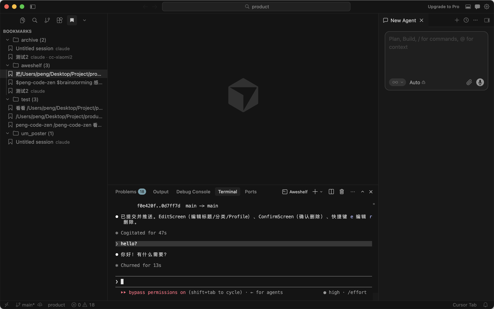

# 让你的 AI 编程会话持久化 — aweshelf 将 Codex 团队的最佳实践带给了每一个 Agent

Codex 官方团队的 Jason（[@jxnlco](https://x.com/jxnlco)）最近分享了如何把 OpenAI Codex 用到极致。他的第一条建议就是[**持久化线程（Durable threads）**](https://x.com/jxnlco/status/2057153744630890620)——编程会话应该能跨越时间：你可以随时停下来，过一会儿再回来，从上次中断的地方继续。

这听起来理所当然。但今天的大多数 AI 编程 Agent 并不是这样工作的。

你刚花了一个小时用 Claude Code 调试 auth 中间件的竞态条件。或者你在排查一个 Snakemake 流水线的问题——STAR 比对在新的参考基因组上一直失败。不管哪种情况，这次会话都很有成效——你找到了根本原因，画出了修复方案，甚至已经开始重构了。

然后你关掉了终端。

第二天早上，你打开一个新会话。上下文全没了。你试着回忆昨天做了什么，翻 shell history，grep git log，模模糊糊记得某个文件路径，然后从头开始解释问题。

这就是 AI 编程 Agent 的默认体验。每个会话都是临时的。会话结束，上下文蒸发。

Codex 内置了持久化线程作为一等公民特性。但 Claude Code 呢？Cursor 呢？其他几十个没有内置这个能力的编程 Agent 呢？

这就是 `aweshelf` 要解决的问题——为任何 Agent 提供持久化的会话能力。

GitHub：[github.com/Webioinfo01/aweshelf](https://github.com/Webioinfo01/aweshelf)

## 旧的工作流：会话是一次性的

AI 编程 Agent 能产出有价值的工作：调试会话、重构方案、架构探索、测试策略。但工具链把每个会话都当作临时的。

当你关闭一个 Claude Code 或 Codex 会话，你会丢失：

- 对话历史
- 你正在编辑的文件
- 你建立起来的心智模型
- 你当时使用的 API 端点、模型和 Token

有些平台开始解决这个问题了。OpenAI Codex 有持久化线程。但大多数 Agent 仍然把会话当作一次性的。你关掉终端，上下文就没了。

你可以事后尝试重建。有时能成功。更多时候，你只能从头来过。

代价不仅仅是时间。而是那些让这次会话富有成效的、已经积累起来的推理过程。

## aweshelf 的工作流：收藏、分类、恢复

`aweshelf` 是一个轻量 CLI，用来保存、组织和恢复 AI 编程会话。

核心循环很简单：

```bash
aweshelf bookmark                    # 保存当前会话
aweshelf list                        # 查看所有已保存的会话
aweshelf resume aweshelf_0001        # 恢复一个会话
```

但真正有意思的是保存了什么。一个书签会记录：

- 会话 ID（以便 Agent 能重新连接）
- 项目路径（以便你知道当时在哪个项目工作）
- 标题和分类（以便你以后能找到它）
- aweswitch 配置（以便 Agent 用相同的 API 端点、模型和 Token 重启）

最后这点很重要。如果你用 [aweswitch](https://github.com/mugpeng/aweswitch) 管理多套 API 配置——比如一套用官方 Claude API，一套用自建端点——`aweshelf` 会记住你当时用的是哪套。恢复时，会话从上次中断的地方继续。

不用 aweswitch 也行，`aweshelf` 仍然可用——只是不会自动恢复配置。需要多配置支持时再安装：

```bash
pip install aweswitch
```

## 用例 1：让 Agent 收藏会话

你正在用 Claude Code 深入调试一个问题。你已经浏览了代码库，缩小了问题范围，写了一半修复。或者你正在跟 Agent 一起搭建基因注释流水线，刚刚搞定了 GFF3 解析。不管怎样，你得去开会了。

不用切到终端，你直接说：

```text
把这个会话收藏一下，标题是"修复 auth 竞态条件"，分到 backend 类别。
```

```text
把这个会话收藏为"基因注释流水线——GFF3 解析完成"，分到 bioinfo 类别。
```

Agent 执行：

```bash
aweshelf bookmark -t "Fix auth race condition" -c backend
aweshelf bookmark -t "Gene annotation pipeline — GFF3 parsing done" -c bioinfo
```

没有交互提示，没有手动输入。Agent 知道该用什么参数，因为 `aweshelf` 有稳定的 CLI 和一份 Agent 可读的 SKILL.md。

等你有时间了，你说：

```text
恢复那个 auth 竞态条件的书签。
```

Agent 找到匹配的书签并执行：

```bash
aweshelf resume aweshelf_0003
```

会话在同一个项目中重启，使用相同的 API 配置。你从上次中断的地方继续——全程没有离开 Agent。

## 用例 2：让 Agent 搜索和整理

用了几周之后，你积累了几十个书签。你记不住具体的 ID，但你知道当时在做什么。

你说：

```text
帮我找跟"RNA-seq"相关的书签。
```

Agent 执行：

```bash
aweshelf search "RNA-seq"
```

它报告匹配结果——标题、分类、项目路径——然后问你想操作哪个。

或者你想看更全的：

```text
列出我所有 bioinfo 的书签。
```

```bash
aweshelf list -c bioinfo
```

Agent 也可以批量创建书签。如果你刚完成一个 variant calling 流水线的集成：

```text
把这个会话收藏为"变异检测流水线——DeepGeno 集成完成"，分到 bioinfo 类别。
```

```bash
aweshelf bookmark -t "Variant calling pipeline — DeepGeno integrated" -c bioinfo
```

全程自然语言。你永远不需要记住命令语法。

## 用例 3：让 Agent 用不同的配置恢复

假设你之前用的是官方 Claude API，但现在想用另一个提供商继续——也许是自建端点，用不同的模型。

你说：

```text
恢复 aweshelf_0003，但换成 cc-glm 配置。
```

Agent 执行：

```bash
aweshelf resume aweshelf_0003 --profile cc-glm
```

如果你用 [aweswitch](https://github.com/mugpeng/aweswitch)，`aweshelf` 会在书签中保存原始配置。默认用相同配置恢复，也可以切换到任何已配置的配置。

这在你想测试不同模型处理同一任务的效果时很有用，或者因为成本、可用性原因需要切换提供商时。Agent 处理切换，你专注于工作。

## 用例 4：在 TUI 中浏览 Agent 创建的书签

你的 Agent 已经收藏了好几周的会话。你想看看都有什么。

```bash
aweshelf browse
```

TUI 打开，书签按分类分组。左侧面板是表格，右侧面板是当前选中书签的详情。


按 `/` 可按标题、分类、会话 ID、项目或配置过滤。按 `e` 可内联编辑标题或分类。按 `Enter` 恢复会话。

这是人类和 Agent 工作流的交汇点。Agent 在工作会话中创建和整理书签。人类在 TUI 中浏览、编辑和恢复它们，当需要继续过去的工作时。

你不需要在"Agent 操作"和"人类操作"之间做选择。Agent 负责保存，人类负责浏览。两者操作的是同一份数据。

## 用例 5：从 VS Code 侧边栏恢复

不是所有人都想用终端。[aweshelf VS Code 扩展](https://marketplace.visualstudio.com/items?itemName=webioinfo.aweshelf-ext)在侧边栏添加了一个面板，用来浏览、搜索和恢复书签。



在 VS Code 或 Cursor 扩展市场搜索 **aweshelf-ext** 安装。侧边栏按分类展示书签，右键菜单支持恢复、编辑、复制会话 ID 和删除。

这在你早上打开编辑器、想继续昨天的工作时特别有用——不管是 Web 应用重构还是单细胞 RNA-seq 分析。不用打开终端输入 `aweshelf list`，直接在侧边栏点一下书签就能恢复。

你的 Agent 在昨天的会话中创建的书签就在那里——分好类、可搜索、一键可达。

## 用例 6：让 Agent 找到并恢复任何过去的会话

几个月后，你有了几十个书签。有些已经过时，有些仍然很有价值。

你说：

```text
找到我们之前处理单细胞聚类问题的那个会话。
```

```text
找到 ETL 管道超时的会话。
```

Agent 执行：

```bash
aweshelf search "scRNA-seq clustering"
aweshelf search "ETL timeout"
```

它找到匹配项，展示详情——项目路径、分类、日期、配置——然后问你要不要恢复。

```bash
aweshelf resume aweshelf_0017
```

你不需要记住书签 ID，不需要记住分类。你只需要描述当时在做什么，Agent 就能找到。

这就是需要记 ID 的书签系统和只需要描述需求的书签系统之间的区别。

在 TUI 中也一样。按 `/` 搜索，按 `e` 内联编辑当前单元格——标题、分类和配置都可以在表格中直接修改。无论你习惯用自然语言跟 Agent 交流，还是习惯在 TUI 中用快捷键操作，数据都是同一份。

## 用例 7：按你的方式编辑书签

书签不是静态的。昨天标记为"调试中"的会话，今天可能已经变成"已修复——待审查"。你之前标记为"RNA-seq 质控"的生信流水线，在修好参考基因组问题后，可能需要改名为"RNA-seq 质控——STAR 比对已修复"。

在 TUI 中，按 `e` 进入内联编辑模式，直接在表格中修改标题、分类或配置。`Tab` 切换到下一个字段，`Enter` 保存，`Esc` 取消。


或者告诉 Agent：

```text
把 aweshelf_0005 改名为"重构支付服务"，移到 backend 分类。
```

```text
把 aweshelf_0012 的标题改为"差异表达分析——已修复批次效应"，移到 bioinfo 分类。
```

Agent 执行：

```bash
aweshelf edit aweshelf_0005 -t "Refactor payment service" -c backend
aweshelf edit aweshelf_0012 -t "DEG analysis — fixed batch effect" -c bioinfo
```

无论是你在 TUI 中修改，还是 Agent 通过 CLI 修改——书签在所有地方都会更新。TUI、VS Code 侧边栏和 CLI 看到的是同一份状态。

这就是关键。Agent 做机械性的工作，人类做判断性的工作。数据不关心是谁改的。

## 为什么这很重要

持久化线程这个理念正在获得关注。Jason 给 Codex 用户的建议很明确：让你的会话持久化。OpenAI 把它作为一等公民特性内置到了 Codex 中。

但持久化不应该是某个平台的专属。Claude Code、Cursor、Gemini CLI，以及每一个其他编程 Agent，都值得拥有同样的能力。价值不在于你用的是哪个 Agent——而在于你做过的那些工作，以及你是否还能找到它们。

`aweshelf` 让会话在任何 Agent 上都能持久化，分工简单明了：

**Agent 负责创建。** 在工作会话中，你告诉 Agent 要保存什么。它执行 CLI，填写元数据，整理书签。你专注于代码。

**人类负责浏览。** 当需要继续过去的工作时，你打开 TUI 或 VS Code 侧边栏。你看到书签按分类分组，用点击或按键来过滤、编辑和恢复。

**两者操作同一份数据。** Agent 通过 CLI 写入书签，人类通过 TUI 或 VS Code 读取。没有同步层，没有特殊协议，就是磁盘上的一个 JSON 文件。

这之所以可行，是因为 `aweshelf` 遵循几个原则：

- 同时为人类和 Agent 提供文档
- 通过稳定的 CLI 实现脚本化
- 对破坏性操作保持保守
- 变更前可检查
- 每次操作后易于验证

它不试图成为平台。它不向云端同步。它不需要注册账号。书签在磁盘上，格式是纯 JSON。Agent 可以读写而无需猜测，人类可以浏览而无需记住命令。

## 更多来自 Webioinfo

`aweshelf` 是 [Webioinfo](https://we.webioinfo.top/) 生态的一部分——一系列面向 AI 辅助开发的工具：

- **[aweskill](https://aweskill.webioinfo.top/)** — 面向 47+ AI 编程 Agent 的 CLI Skill 包管理器。在 Claude Code、Codex、Cursor 等 Agent 之间安装、更新和投影 Skill。
- **[awescholar](https://github.com/mugpeng/awescholar)** — 自动化学文献检索。搜索、标注、过滤，用 LLM 流水线生成研究报告。
- **[aweswitch](https://github.com/mugpeng/aweswitch)** — Agent 配置切换器。用不同的 API 端点、Token 和模型启动会话。

## 试一试

安装：

```bash
pip install aweshelf
```

收藏当前会话：

```bash
aweshelf bookmark
```

浏览你的书签：

```bash
aweshelf browse
```

或者告诉你的编程 Agent：

```text
读一下 https://github.com/Webioinfo01/aweshelf/blob/main/README.ai.md ，按照说明为这个 Agent 安装 aweshelf。
```

如果你使用多套 API 配置，安装 [aweswitch](https://github.com/mugpeng/aweswitch) 即可在书签中保存和恢复配置。

---

**安装**：`pip install aweshelf`

**VS Code 扩展**：[aweshelf-ext on Marketplace](https://marketplace.visualstudio.com/items?itemName=webioinfo.aweshelf-ext)

**GitHub**：[github.com/Webioinfo01/aweshelf](https://github.com/Webioinfo01/aweshelf)

**更多工具**：[we.webioinfo.top](https://we.webioinfo.top/)
